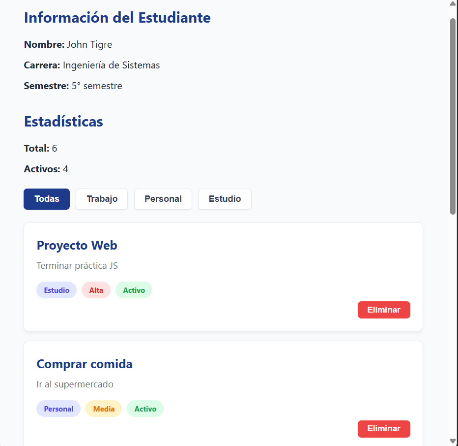
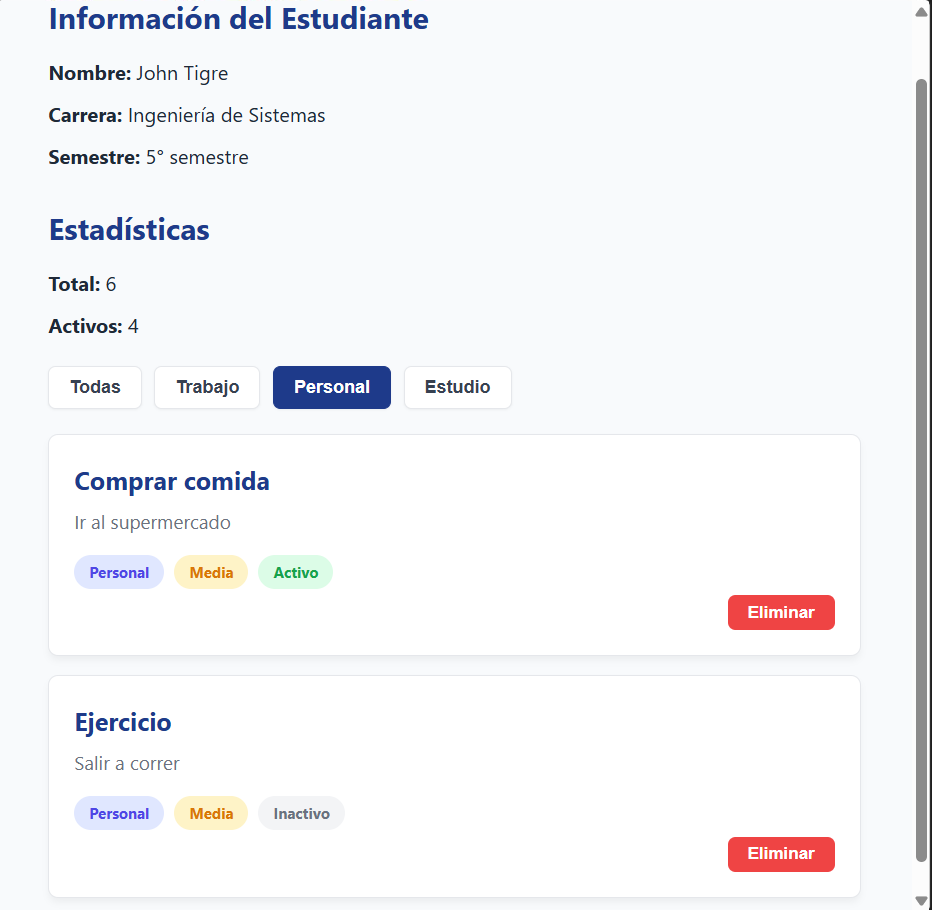

# Práctica 02 - Manipulación Básica del DOM

## 1. Descripción breve de la solución
Esta aplicación web es un gestor de tareas sencillo que demuestra la manipulación dinámica del DOM usando JavaScript puro. Permite mostrar una lista de tareas mediante tarjetas, ver estadísticas en tiempo real (total de tareas y activas), filtrar los elementos según su categoría y eliminar tareas específicas tanto de la interfaz gráfica como del arreglo de datos subyacente.

## 2. Fragmentos de código relevantes

### 2.1 Renderizado de la lista
Se utiliza `createElement` junto con un `DocumentFragment` para construir las tarjetas de forma segura y optimizar la inserción en el DOM sin causar múltiples recargas visuales (reflows).

```javascript
function renderizarLista(datos) {
    const contenedor = document.getElementById('contenedor-lista');
    contenedor.innerHTML = '';
    const fragment = document.createDocumentFragment();

    datos.forEach(el => {
        const card = document.createElement('div');
        card.classList.add('card');
        
        // ... (creación y ensamble de elementos HTML) ...

        fragment.appendChild(card);
    });

    contenedor.appendChild(fragment);
    actualizarEstadisticas();
}
```

### 2.2 Eliminación de elementos
Busca el índice del elemento por su ID, lo elimina del arreglo original usando `splice` y vuelve a renderizar la vista actualizada.

```javascript
function eliminarElemento(id) {
    const index = elementos.findIndex(el => el.id === id);
    if (index !== -1) {
        elementos.splice(index, 1);
        renderizarLista(elementos);
    }
}
```

### 2.3 Filtrado
Captura la categoría del botón mediante atributos `data-*`, filtra el arreglo original con `.filter()` y envía la nueva lista a la función de renderizado.

```javascript
botones.forEach(btn => {
    btn.addEventListener('click', () => {
        const categoria = btn.dataset.categoria;
        
        // ... (actualización visual de clases activas) ...

        if (categoria === 'todas') {
            renderizarLista(elementos);
        } else {
            const filtrados = elementos.filter(e => e.categoria === categoria);
            renderizarLista(filtrados);
        }
    });
});
```

## 3. Imágenes de la Aplicación

### Vista general de la aplicación


### Filtrado aplicado.
