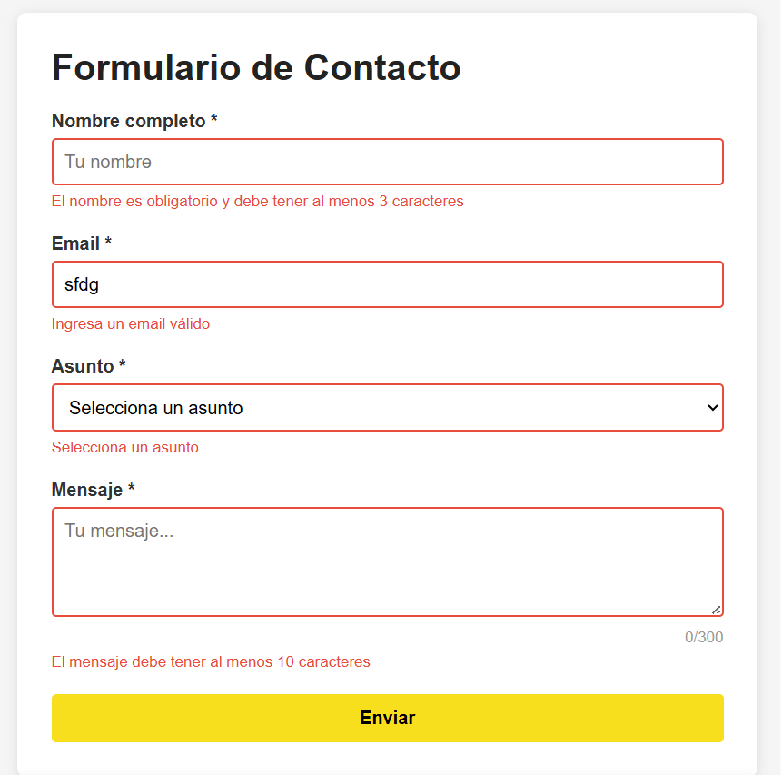
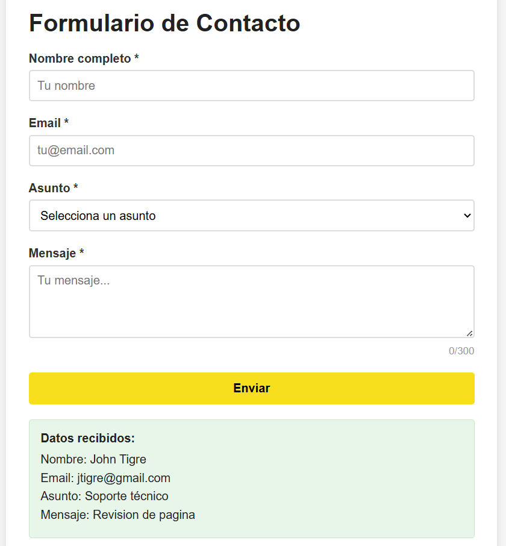
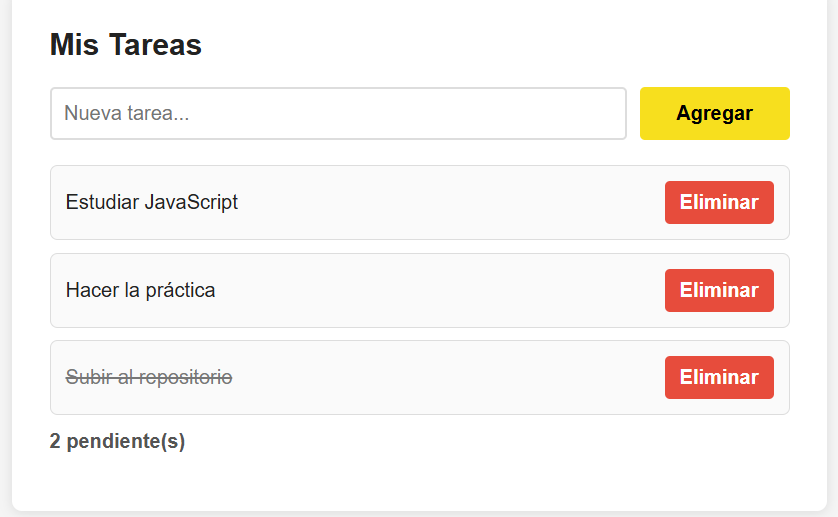
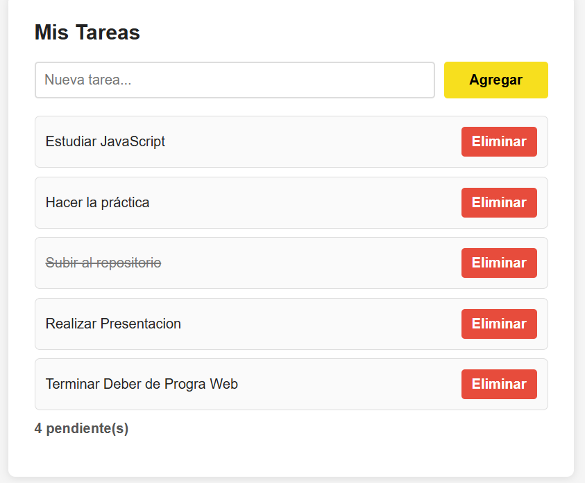
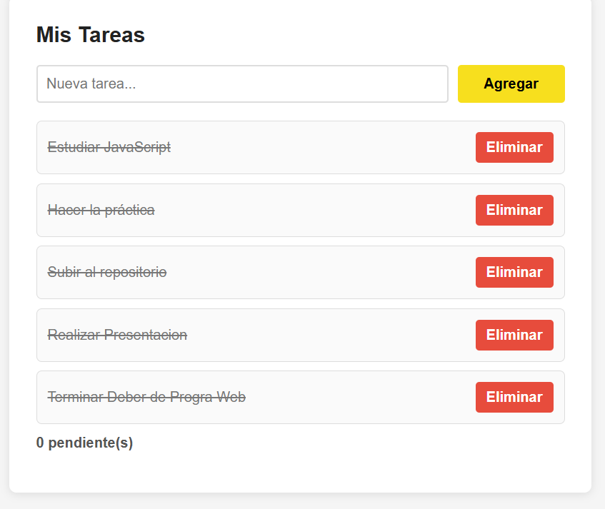

# Práctica 3: Eventos en JavaScript

**Autor:** John Tigre

## 1. Descripción de la solución implementada

En esta práctica se desarrolló una interfaz web interactiva aplicando los conceptos fundamentales de eventos en el DOM con JavaScript. La solución aborda dos requerimientos principales sin el uso de librerías externas:

1. **Formulario de Contacto Interactivo:** Se implementó un sistema de validación en tiempo real. Utilizando eventos como `blur`, `input` y `change`, el formulario provee retroalimentación visual inmediata al usuario (mostrando u ocultando mensajes de error y ajustando estilos al vuelo). Se previene el envío nativo del formulario para validar los datos mediante expresiones regulares y lógica de longitud, procesando la información de forma local y segura.
2. **Gestor de Tareas (To-Do List):** Se construyó una lista de tareas dinámica donde el usuario puede agregar, completar y eliminar elementos. Para optimizar el rendimiento y el manejo de la memoria del navegador, se aplicó el patrón de *Event Delegation*, gestionando todas las interacciones de los ítems dinámicos (que cambian constantemente) desde un único *event listener* en el contenedor principal `<ul>`.

---

## 2. Código destacado

### 2.1 Validación de formulario con `preventDefault()`
Al momento de enviar el formulario, se intercepta el evento `submit` utilizando `e.preventDefault()`. Esto evita la recarga de la página web. A continuación, se ejecutan las funciones validadoras. Si todos los campos son correctos, se genera el DOM dinámicamente para mostrar los resultados; caso contrario, se detiene el flujo y se aplica el método `.focus()` al primer campo que presente un error para mejorar la experiencia del usuario.

```javascript
formulario.addEventListener('submit', (e) => {
  e.preventDefault();

  const nombreValido = validarNombre();
  const emailValido = validarEmail();
  const asuntoValido = validarAsunto();
  const mensajeValido = validarMensaje();

  if (nombreValido && emailValido && asuntoValido && mensajeValido) {
    mostrarResultado();
    resetearFormulario();
    return;
  }
  
  // Si hay errores, se hace focus en el primer campo inválido
  if (!nombreValido) { inputNombre.focus(); return; }
  if (!emailValido) { inputEmail.focus(); return; }
  if (!asuntoValido) { selectAsunto.focus(); return; }
  textMensaje.focus();
});
```

### 2.2 Event delegation en la lista de tareas
En lugar de añadir un evento de clic a cada botón de "Eliminar" o a cada texto creado dinámicamente, se añade un único *listener* al elemento padre (`#lista-tareas`). Mediante la propiedad `e.target.dataset.action` se identifica qué acción desea realizar el usuario. Luego, utilizando el método `e.target.closest('li')`, se localiza el elemento contenedor exacto para extraer su ID y actualizar el arreglo de datos en memoria antes de re-renderizar la vista.

```javascript
listaTareas.addEventListener('click', (e) => {
  const action = e.target.dataset.action;
  if (!action) return;

  const item = e.target.closest('li');
  if (!item || !item.dataset.id) return;

  const id = Number(item.dataset.id);

  if (action === 'eliminar') {
    tareas = tareas.filter((tarea) => tarea.id !== id);
    renderizarTareas();
  }

  if (action === 'toggle') {
    const tarea = tareas.find((itemTarea) => itemTarea.id === id);
    if (tarea) {
      tarea.completada = !tarea.completada;
      renderizarTareas();
    }
  }
});
```

### 2.3 Atajo de teclado con Ctrl+Enter
Se implementó un evento de teclado a nivel global (`document`). Cuando se detecta que el usuario presiona la tecla `Enter` (`e.key === 'Enter'`) mientras mantiene presionada la tecla `Control` (`e.ctrlKey`), se invoca el método `formulario.requestSubmit()`. A diferencia del método tradicional `.submit()`, `requestSubmit()` sí dispara los *event listeners* asociados al formulario, asegurando que el proceso de validación no se salte.

```javascript
document.addEventListener('keydown', (e) => {
  if (e.ctrlKey && e.key === 'Enter') {
    e.preventDefault();
    formulario.requestSubmit();
  }
});
```

---

## 3. Capturas de la implementación

A continuación se evidencia el correcto funcionamiento de las funcionalidades desarrolladas:

**Validación en acción:**



**Formulario procesado:**



**Event delegation funcionando:**



**Contador de tareas actualizado:**



**Tareas completadas:**

