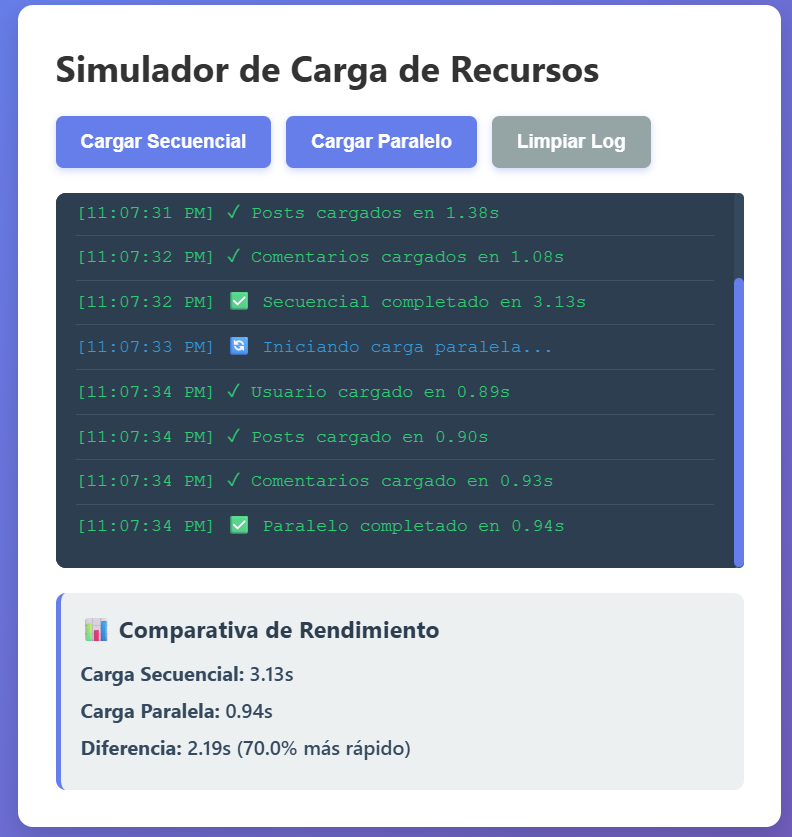
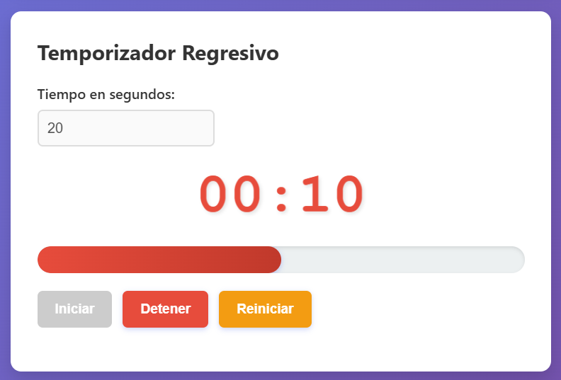
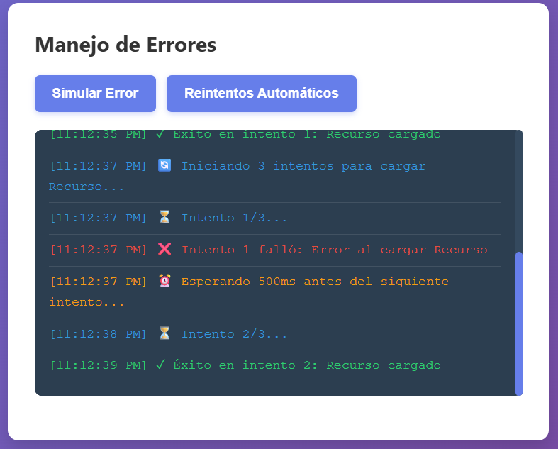

# Práctica 5: Programación Asíncrona en JavaScript

**Autor:** John Tigre

## 1. Descripción del Simulador Implementado.

En esta práctica se construyó una aplicación web para demostrar el comportamiento y control del flujo asíncrono en JavaScript. La aplicación consta de tres módulos:
1. **Simulador de Carga de Recursos:** Compara visualmente y mediante métricas de rendimiento la diferencia entre resolver promesas una tras otra (Secuencial) frente a resolverlas simultáneamente (Paralela).
2. **Temporizador Regresivo:** Implementa la manipulación del DOM combinada con la Web API `setInterval`, gestionando estados (iniciar, pausar, reiniciar) y limpiando el intervalo de memoria correctamente con `clearInterval`.
3. **Manejo de Errores Avanzado:** Demuestra la captura segura de excepciones en flujos asíncronos mediante `try/catch` y la implementación de un algoritmo de reintentos automáticos con *Backoff Exponencial* (tiempos de espera incrementales).

---

## 2. Análisis de Rendimiento: Secuencial vs Paralelo.

Al ejecutar el simulador, la diferencia arquitectónica entre ambas estrategias es evidente:
* **Carga Secuencial:** El tiempo total de ejecución es la suma del tiempo de respuesta de cada petición individual. Cada `await` bloquea la ejecución de la siguiente línea hasta que su promesa se resuelve.
* **Carga Paralela:** Al utilizar `Promise.all()`, las tres peticiones se despachan al mismo tiempo hacia la Web API. El tiempo total de ejecución equivale, de manera aproximada, al tiempo que tarda la promesa *más lenta* del bloque. En la interfaz se evidencia una reducción del tiempo de ejecución de entre un 50% y 70%.

---

## 3. Código Destacado.

### 3.1 Función que retorna promesa con `setTimeout`
Se envuelve el `setTimeout` dentro de una nueva `Promise` para poder simular peticiones de red asíncronas controlables.

```javascript
function simularPeticion(nombre, tiempoMin = 500, tiempoMax = 2000, fallar = false) {
  return new Promise((resolve, reject) => {
    const tiempoDelay = Math.floor(Math.random() * (tiempoMax - tiempoMin + 1)) + tiempoMin;
    setTimeout(() => {
      if (fallar) reject(new Error(`Error al cargar ${nombre}`));
      else resolve({ nombre, tiempo: tiempoDelay, timestamp: new Date().toLocaleTimeString() });
    }, tiempoDelay);
  });
}
```

### 3.2 Carga secuencial con `await` consecutivos
Cada variable espera a que la anterior termine.

```javascript
async function cargarSecuencial() {
  try {
    const usuario = await simularPeticion('Usuario', 500, 1000);
    const posts = await simularPeticion('Posts', 700, 1500);
    const comentarios = await simularPeticion('Comentarios', 600, 1200);
    // Tiempo Total = ~ (1000ms + 1500ms + 1200ms) = 3.7 segundos
  } catch (error) {
    // Manejo de errores
  }
}
```

### 3.3 Carga paralela con `Promise.all`
El arreglo de promesas se dispara simultáneamente.

```javascript
async function cargarParalelo() {
  try {
    const promesas = [
      simularPeticion('Usuario', 500, 1000),
      simularPeticion('Posts', 700, 1500),
      simularPeticion('Comentarios', 600, 1200)
    ];
    // Se detiene aquí hasta que TODAS terminen
    const resultadosPromesas = await Promise.all(promesas);
    // Tiempo Total = ~1500ms (La petición más lenta)
  } catch (error) {
    // Falla inmediatamente si alguna falla
  }
}
```

### 3.4 Manejo de errores con `try/catch`
Mecanismo seguro para atrapar el `reject` de una promesa en funciones `async`.

```javascript
async function simularError() {
  try {
    await simularPeticion('API', 500, 1000, true); // Fallar = true
  } catch (error) {
    mostrarLogError(`❌ Error capturado: ${error.message}`, 'error');
  }
}
```

### 3.5 Temporizador con `setInterval`
Actualización periódica de la UI y cancelación para evitar fugas de memoria.

```javascript
intervaloId = setInterval(() => {
  tiempoRestante--;
  actualizarDisplay();

  if (tiempoRestante <= 0) {
    clearInterval(intervaloId);
    intervaloId = null;
    display.classList.add('alerta');
    alert('⏰ ¡Tiempo terminado!');
  }
}, 1000);
```

---

## 4. Capturas.

**Comparativa secuencial vs paralelo con tiempos:**



**Temporizador funcionando con barra de progreso:**



**Error capturado y mostrado en UI:**

