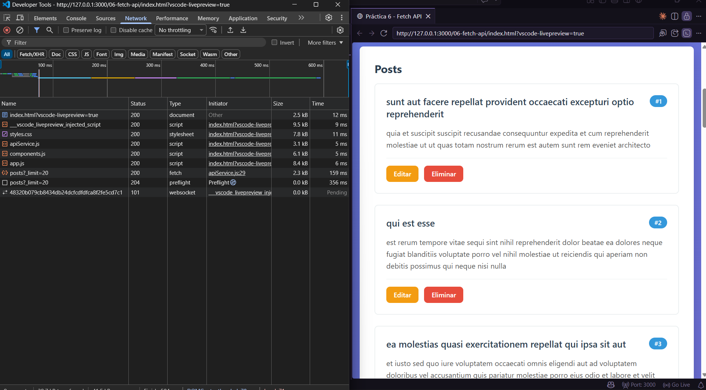
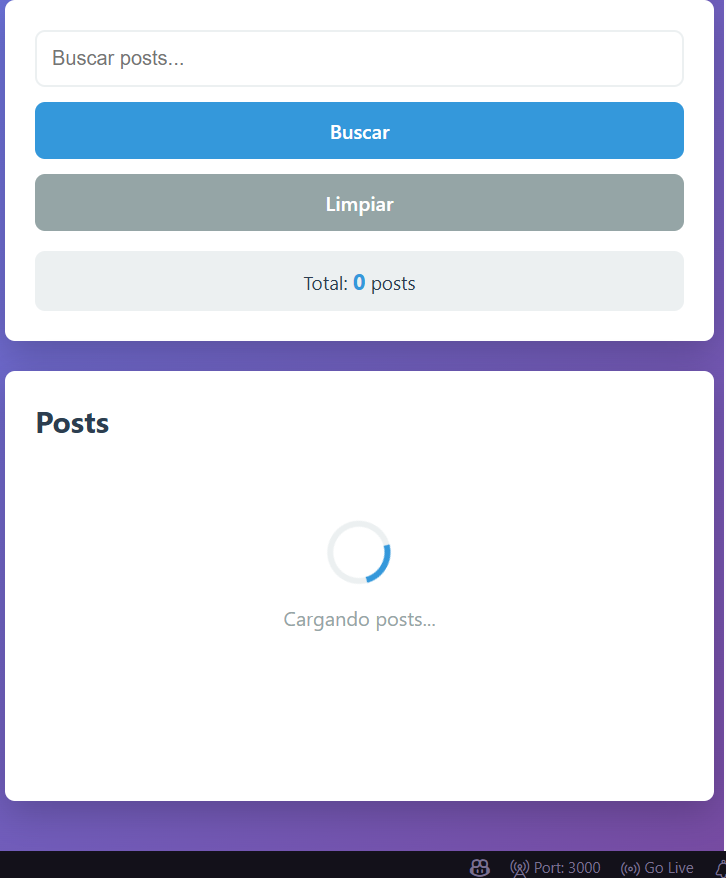
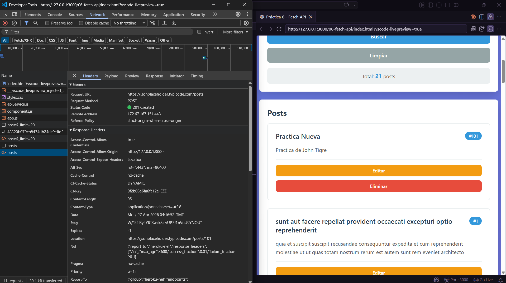
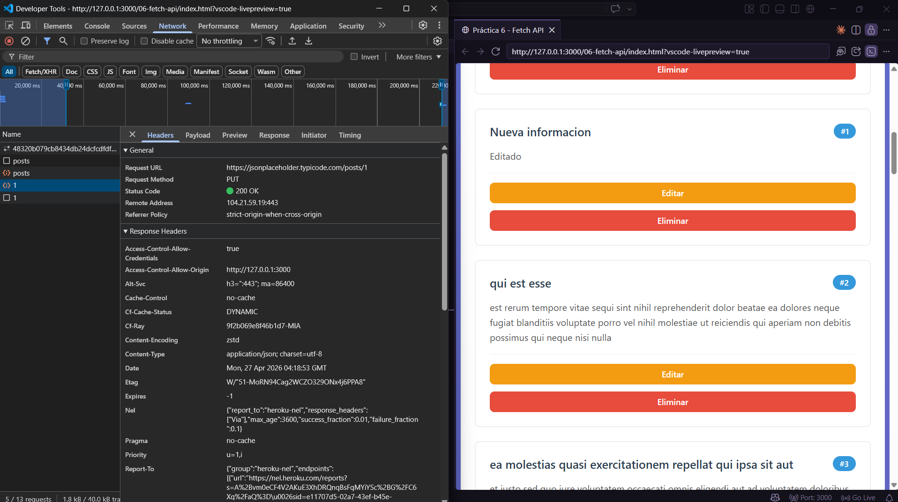
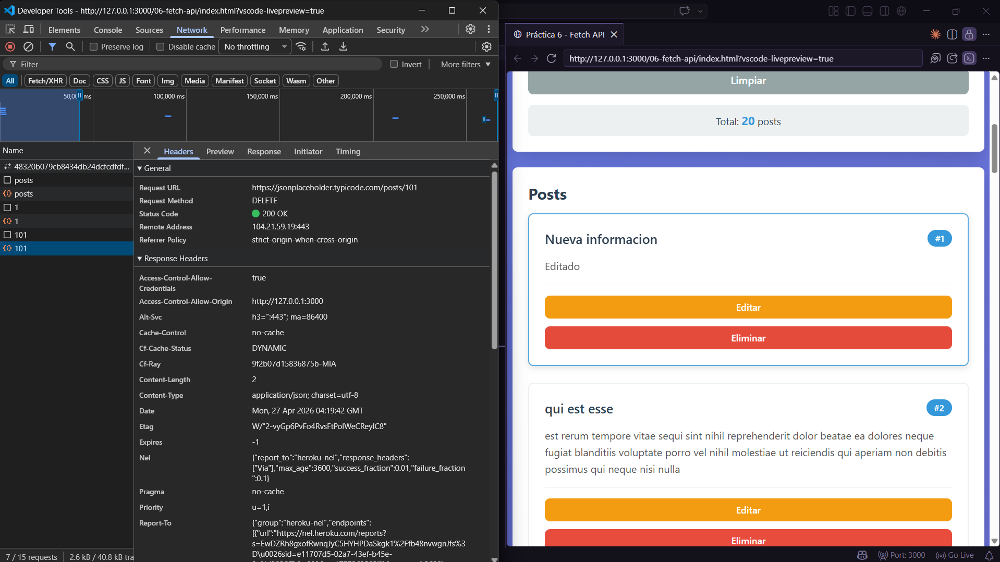
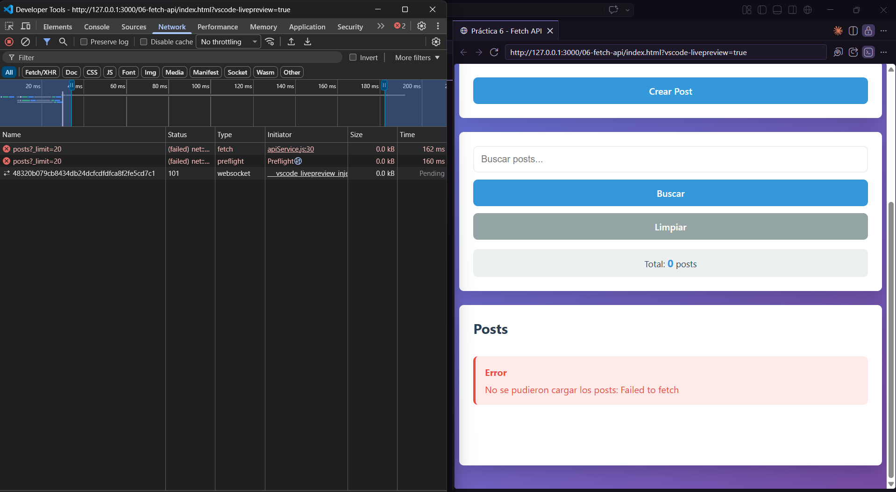
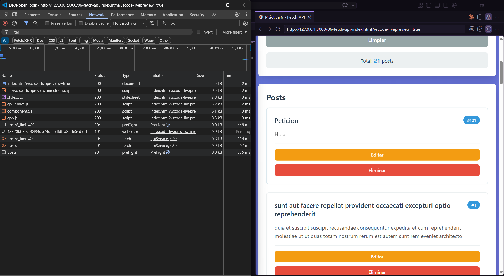
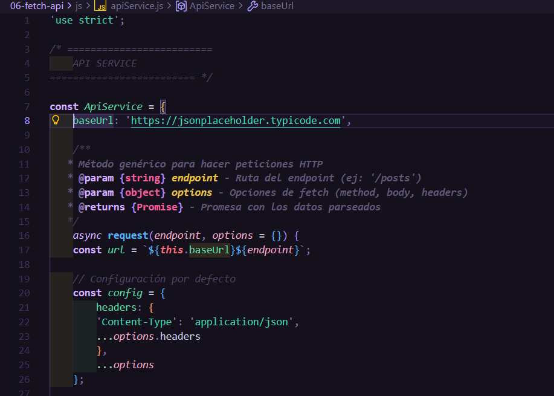

# Práctica 6: Fetch API y Consumo de Servicios

**Autor:** John Tigre

## 1. Descripción

En esta práctica se desarrolló una aplicación web (Gestor de Posts) que se comunica de forma asíncrona con una API REST pública (`JSONPlaceholder`). El proyecto se estructuró dividiendo responsabilidades y aplicando las mejores prácticas de seguridad y rendimiento de JavaScript Vanilla:

* **Servicio API Centralizado (`ApiService`):** Se implementó un objeto dedicado a manejar las peticiones HTTP (`GET`, `POST`, `PUT`, `DELETE`) utilizando la moderna **Fetch API** con la sintaxis `async/await`. Se valida estrictamente la propiedad `response.ok` para capturar errores HTTP.
* **Manipulación Segura del DOM:** Se construyeron los componentes visuales (tarjetas, spinners, mensajes) utilizando exclusivamente la API del DOM (`document.createElement`, `appendChild`). Se reemplazó el uso inseguro de `innerHTML` por `textContent` para inyectar datos dinámicos, previniendo vulnerabilidades de inyección de código (XSS).
* **Gestión de Interfaz y Estado:** La aplicación gestiona el estado local (arreglos de datos), incorpora un buscador en tiempo real y maneja un flujo de retroalimentación visual completa (spinners de carga y notificaciones de éxito/error) sin recargar la página.

---

## 2. Código Destacado

### 2.1 Petición genérica y validación (`ApiService`)
El método `request` centraliza las llamadas a `fetch`. Captura excepciones de red y verifica el código de estado HTTP para lanzar errores en respuestas `4xx` o `5xx` que Fetch ignora por defecto.

```javascript
async request(endpoint, options = {}) {
  const url = `${this.baseUrl}${endpoint}`;
  const config = {
    headers: { 'Content-Type': 'application/json', ...options.headers },
    ...options
  };

  try {
    const response = await fetch(url, config);
    if (!response.ok) {
      throw new Error(`HTTP Error: ${response.status} ${response.statusText}`);
    }
    return response.status === 204 ? null : await response.json();
  } catch (error) {
    console.error('Error en petición:', error);
    throw error;
  }
}
```

### 2.2 Creación segura de componentes
Ejemplo de cómo se construyen los mensajes de error retornando elementos HTML directamente mediante la API del DOM, sin utilizar concatenación de *strings* ni `innerHTML`.

```javascript
function MensajeError(mensaje) {
  const container = document.createElement('div');
  container.className = 'error';

  const titulo = document.createElement('strong');
  titulo.textContent = 'Error';

  const texto = document.createElement('p');
  texto.textContent = mensaje;

  container.appendChild(titulo);
  container.appendChild(texto);

  return container;
}
```

---

## 3. Resultados y Evidencias

A continuación, se presentan las pruebas de funcionamiento de las operaciones CRUD y el manejo de estado de la aplicación.

### 3.1 Datos cargados desde la API



**Descripción:** Se obtienen los primeros 20 registros desde la API simulada utilizando el método `GET`. Los datos se parsean desde JSON y se renderizan dinámicamente en la página construyendo los nodos del DOM.

### 3.2 Estado de carga visible



**Descripción:** Se muestra un componente visual animado (Spinner) indicando que hay una petición en curso. Esto mejora la experiencia de usuario mientras se espera la resolución de la promesa de Fetch.

### 3.3 Crear Post (Formulario enviado)



**Descripción:** Se ejecuta una petición `POST` enviando un body en formato JSON. JSONPlaceholder simula la creación, devuelve el objeto con el ID 101, y este nuevo ítem se inserta al inicio de la lista visual.

### 3.4 Editar Post (Item modificado)



**Descripción:** Al editar, el formulario se puebla con los datos existentes. Al enviar, se dispara una petición `PUT` reemplazando los datos del recurso en la API y actualizando instantáneamente la tarjeta correspondiente en la UI.

### 3.5 Eliminar Post



**Descripción:** Tras la confirmación del usuario, se envía un `DELETE` a la API. Al resolverse la promesa exitosamente, el ítem es removido del arreglo local (filtrado) y el DOM se vuelve a renderizar.

### 3.6 Manejo de Errores (Fallo de petición)



**Descripción:** Se simula un error de red modificando el endpoint. La excepción es capturada exitosamente por el bloque `try/catch` de la función asíncrona, y se muestra un mensaje de error claro en la UI (no solo en consola).

### 3.7 Pestaña Network (DevTools)



**Descripción:** En la pestaña Network del navegador se evidencia la trazabilidad de las peticiones HTTP realizadas por la Fetch API, observando los códigos de estado correctos (`200 OK` para lectura/actualización, `201 Created` para creación).

### 3.8 Estructura del Código



**Descripción:** Captura del código fuente mostrando la configuración del módulo `ApiService`, donde se declara la URL base y se implementa el método asíncrono genérico respetando las buenas prácticas exigidas.