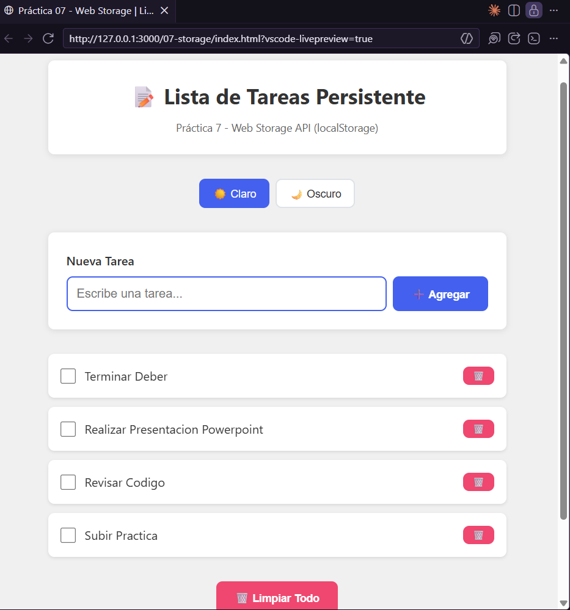
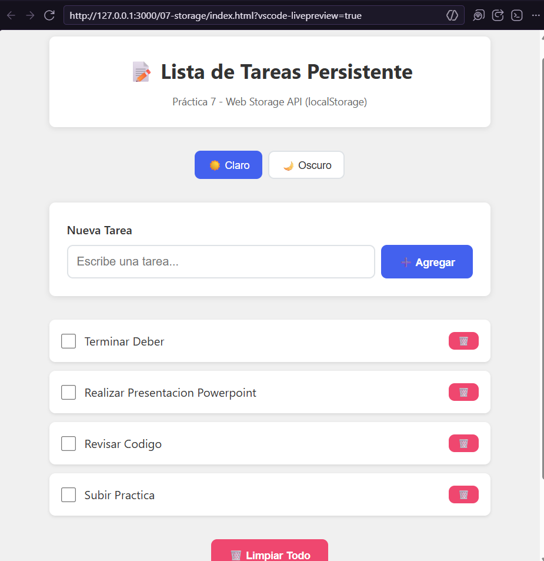
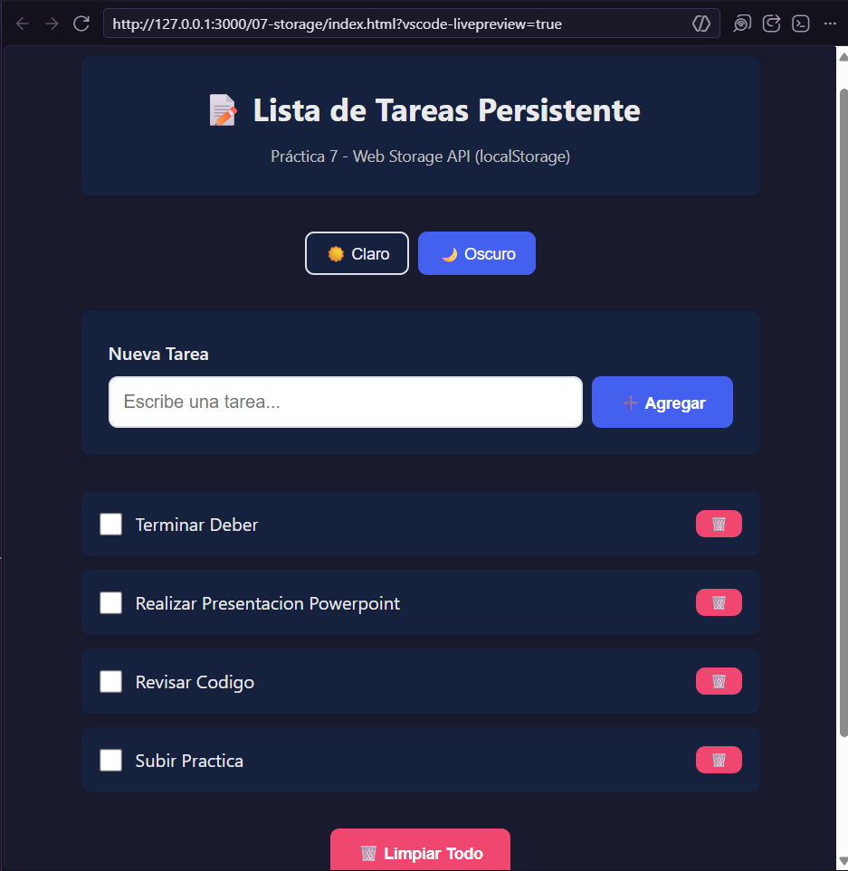
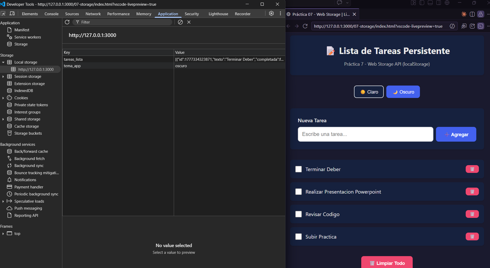
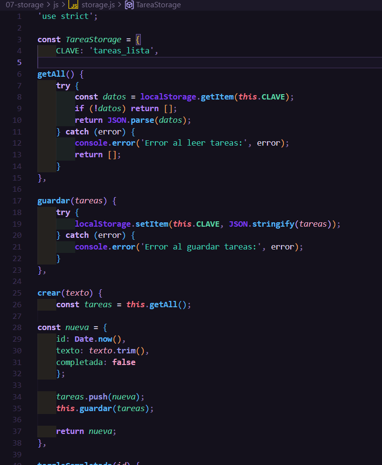
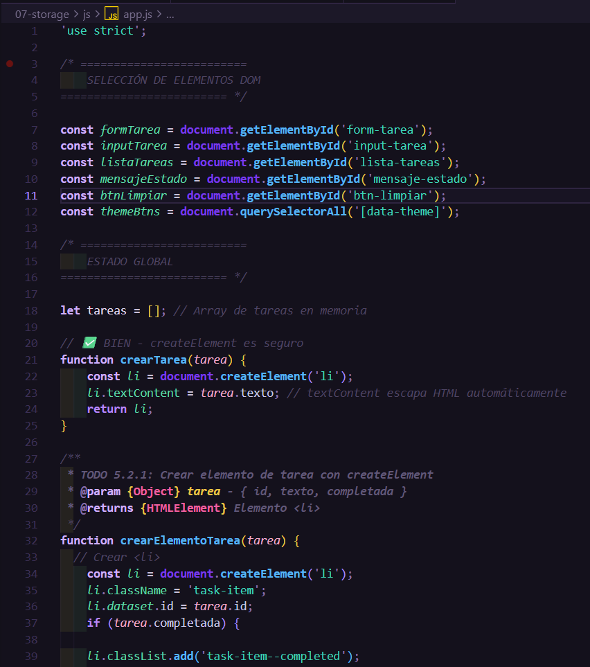

# Práctica 7: Web Storage y Persistencia

**Autor:** John Tigre

## 1. Descripción

En esta práctica se desarrolló una aplicación de Lista de Tareas ("To-Do List") centrada en la persistencia de datos en el cliente mediante la API de **Web Storage** (`localStorage`). Se implementó un patrón de arquitectura basado en Servicios, separando la lógica de acceso a datos de la manipulación del DOM. La aplicación permite realizar operaciones CRUD, persistir preferencias visuales (tema claro/oscuro). Se priorizó la seguridad utilizando exclusivamente `document.createElement` y `textContent` para la inyección de datos, previniendo ataques XSS.

---

## 2. Código Destacado

### 2.1 Servicio de Storage en archivo separado
Se centralizó toda la lectura y escritura de `localStorage` en un archivo independiente (`storage.js`). Se maneja la serialización obligatoria y la prevención de errores con bloques `try/catch`.

```javascript
const TareaStorage = {
  CLAVE: 'tareas_lista',
  
  getAll() {
    try {
      const datos = localStorage.getItem(this.CLAVE);
      if (!datos) return [];
      return JSON.parse(datos);
    } catch (error) {
      console.error('Error al leer tareas:', error);
      return [];
    }
  },
  
  guardar(tareas) {
    try {
      localStorage.setItem(this.CLAVE, JSON.stringify(tareas));
    } catch (error) {
      console.error('Error al guardar tareas:', error);
    }
  }
};
```

### 2.2 Creación Segura del DOM (`createElement`)
Se reemplazó la práctica insegura de usar `innerHTML` para datos provenientes del usuario. En su lugar, se crean los nodos paso a paso asignando el texto mediante `textContent`.

```javascript
// En app.js dentro de crearElementoTarea(tarea)
const span = document.createElement('span');
span.className = 'task-item__text';
span.textContent = tarea.texto; // Seguro contra inyección de HTML
```

---

## 3. Resultados y Evidencias

### 1. Lista con datos persistentes

**Descripción:** Se crearon tareas a través del formulario y son visibles en la interfaz. 

### 2. Persistencia

**Descripción:** Al recargar la página, se verifica que los datos de las tareas persisten correctamente sin borrarse.

### 3. Tema oscuro

**Descripción:** Cambio de tema aplicado mediante el selector, guardando la preferencia de interfaz del usuario.

### 4. DevTools - Local Storage

**Descripción:** En DevTools > Application > Local Storage se ve la clave `tareas_lista` con el arreglo JSON de las tareas y la clave `tema_app`.

### 5. Código

**Descripción:** Captura del servicio de Storage (`storage.js`) encapsulando la lógica de guardado y lectura.


**Descripción:** Captura de la aplicación principal (`app.js`) realizando la manipulación segura del DOM con `createElement`.