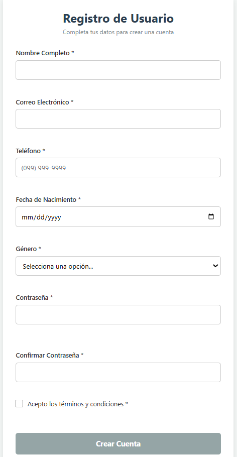
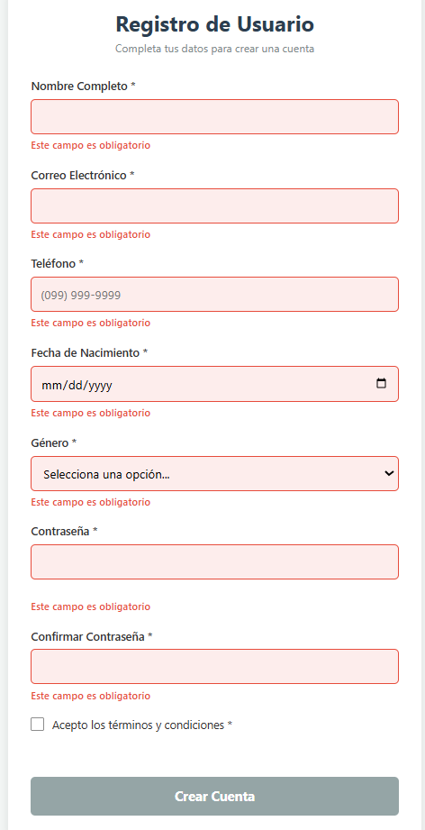
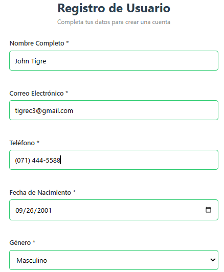
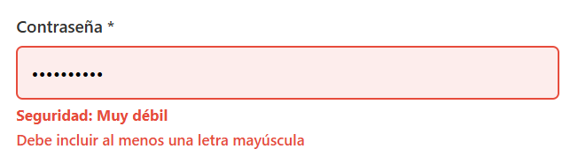
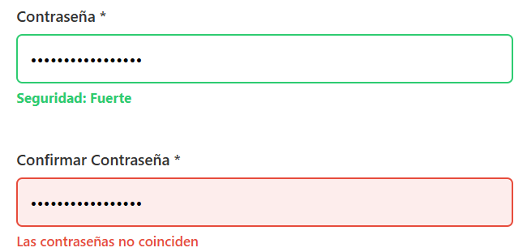
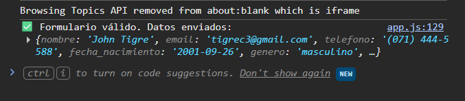
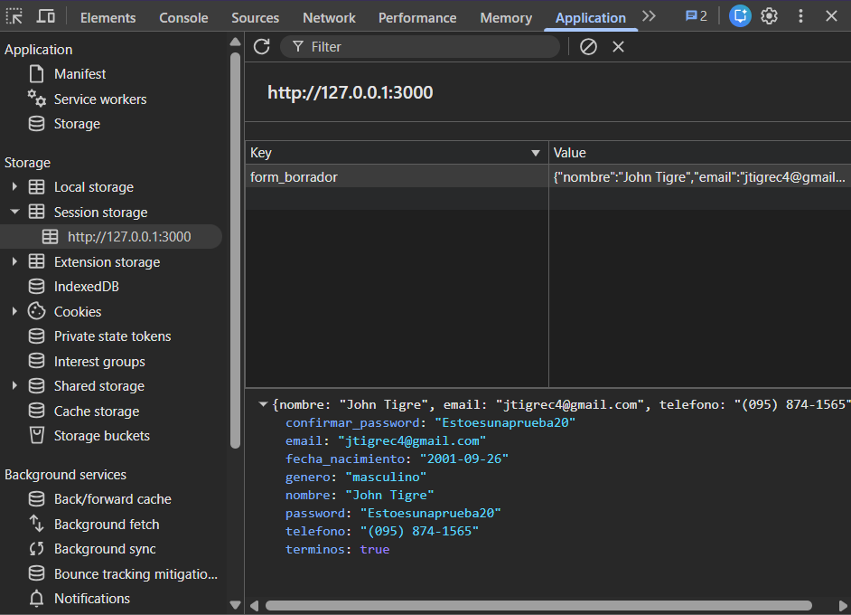
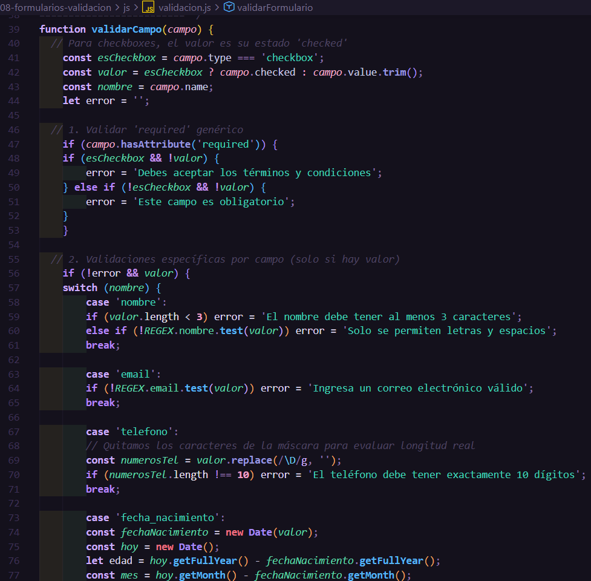

# Práctica 8: Formularios y Validación

**Autor:** John Tigre

## 1. Descripción

En esta práctica se desarrolló un formulario de registro interactivo empleando validaciones personalizadas con JavaScript puro. Se desactivó la validación nativa del navegador mediante el atributo `novalidate` para tomar control total del *feedback* visual, evaluando las entradas del usuario en tiempo real (mediante los eventos `input` y `focusout`). El sistema aplica reglas lógicas y Expresiones Regulares (REGEX) para 8 campos distintos, previniendo el envío de datos incorrectos. Adicionalmente, se integraron características avanzadas de experiencia de usuario (UX) como una máscara de formato telefónico automático y el autoguardado de borradores en el `sessionStorage`.

---

## 2. Código Destacado

### 2.1 Lógica de Validación Centralizada
El código utiliza una función que evalúa el contenido de los inputs según su atributo `name`, inyectando o removiendo clases CSS de error de forma segura en el DOM.

```javascript
function validarCampo(campo) {
  const esCheckbox = campo.type === 'checkbox';
  const valor = esCheckbox ? campo.checked : campo.value.trim();
  let error = '';

  // Validar 'required'
  if (campo.hasAttribute('required') && !valor) {
    error = esCheckbox ? 'Debes aceptar los términos y condiciones' : 'Este campo es obligatorio';
  }

  // Validaciones por Expresión Regular y reglas lógicas
  if (!error && valor) {
    switch (campo.name) {
      case 'password':
        if (valor.length < 8) error = 'Mínimo 8 caracteres';
        else if (!REGEX.password.test(valor)) error = 'Debe incluir mayúsculas, minúsculas y números';
        break;
      // ... otros casos evaluados
    }
  }
  // Se aplican las funciones de feedback visual (mostrarError / limpiarError)
}
```

### 2.2 Funcionalidad Extra: Autoguardado (`sessionStorage`)
Se implementó una función que captura los datos actuales del formulario transformándolos en un objeto plano, guardándolos temporalmente para prevenir pérdida de información si la pestaña se recarga.

```javascript
function guardarBorrador() {
  const formData = new FormData(form);
  const datos = Object.fromEntries(formData);
  datos.terminos = form.querySelector('#terminos').checked;
  sessionStorage.setItem('form_borrador', JSON.stringify(datos));
}
// Se ejecuta en cada evento 'input'
```

### 2.3 Recopilación de Datos con `FormData`
Al procesar el envío (`submit`), se previenen comportamientos por defecto y se estructuran los datos eliminando campos que no necesitan viajar al backend (como la confirmación de la contraseña).

```javascript
form.addEventListener('submit', (e) => {
  e.preventDefault();
  if (validarFormulario(form)) {
    const datosFinales = Object.fromEntries(new FormData(form));
    delete datosFinales.confirmar_password;
    console.log('✅ Formulario válido. Datos enviados:', datosFinales);
    // Limpieza de interfaz y de sessionStorage
  }
});
```

---

## 3. Resultados y Evidencias

A continuación, se presentan las pruebas de funcionamiento de los distintos estados del formulario:

### 1. Formulario inicial

**Descripción:** Vista inicial del formulario de registro renderizado con sus 8 campos correspondientes en estado neutro.

### 2. Errores de Validación

**Descripción:** *Feedback* visual en tiempo real. Los campos obligatorios muestran un contorno rojo y el mensaje específico de error tras perder el foco (`focusout`) estando vacíos.

### 3. Campos Válidos

**Descripción:** El sistema reconoce los valores correctos mediante REGEX y lógica de negocio, aplicando un borde verde como indicador de éxito.

### 4. Fuerza de Contraseña

**Descripción:** Un evaluador en tiempo real analiza la entropía de la clave a medida que el usuario escribe, indicando niveles como "Muy débil", "Media" o "Fuerte".

### 5. Confirmación de Password

**Descripción:** Validación cruzada que bloquea el proceso si la confirmación de la contraseña no coincide exactamente con el valor original tecleado.

### 6. Envío Exitoso

**Descripción:** Tras una validación exitosa en todos los campos, se intercepta el `submit` y los datos recopilados por `FormData` se muestran correctamente procesados en la consola del navegador.

### 7. Funcionalidad Extra (Autoguardado y Máscara)

**Descripción:** Se visualiza el panel de DevTools (*Application*) demostrando el registro de las entradas en `sessionStorage`. Adicionalmente, el campo de teléfono muestra la máscara visual `(099) 999-9999` aplicada dinámicamente.

### 8. Código de Validación

**Descripción:** Captura de la función central `validarCampo()` demostrando la evaluación y el control de flujo basado en el atributo `name` de los campos.