# Práctica 8: Formularios y Validación

**Autor:** John Tigre

## 1. Descripción de la Práctica

En esta práctica se construyó un formulario de registro robusto aplicando los principios de validación del lado del cliente mediante JavaScript puro. Se desactivó la API nativa de validación HTML5 (`novalidate`) para proveer un *feedback* visual personalizado en tiempo real. Se implementó un patrón de diseño modular que separa la lógica de negocio y las expresiones regulares (`validacion.js`), la creación segura de la interfaz de usuario para prevenir vulnerabilidades XSS (`components.js`), y el enlazado de eventos (`app.js`). Además, se implementó la API `FormData` para la recopilación y estructuración de los datos finales.

---

## 2. Código Destacado

### 2.1 Validación Centralizada con Regex
La evaluación de los campos ocurre en un servicio dedicado, utilizando sentencias de control y expresiones regulares probadas para determinar la validez antes de inyectar errores al DOM.

```javascript
case 'telefono':
  if (!REGEX.telefono.test(valor.replace(/\D/g, ''))) {
    error = 'El teléfono debe tener exactamente 10 dígitos';
  }
  break;

case 'fecha_nacimiento':
  const fechaNac = new Date(valor);
  const hoy = new Date();
  // ... lógica de cálculo de edad precisa
  if (edadReal < 18) {
    error = 'Debes ser mayor de 18 años';
  }
  break;
```

### 2.2 Componentes Seguros (`createElement`)
Se reemplazó la práctica de concatenación de cadenas mediante `innerHTML` por el uso explícito de la API del DOM para la generación de mensajes y tarjetas de resultados.

```javascript
function MensajeError(mensaje) {
  const container = document.createElement('div');
  container.className = 'mensaje-error';

  const titulo = document.createElement('strong');
  titulo.textContent = '✗ Error';

  const texto = document.createElement('p');
  texto.textContent = mensaje; // textContent es seguro contra XSS

  container.appendChild(titulo);
  container.appendChild(texto);

  return container;
}
```

### 2.3 Procesamiento con `FormData`
El proceso de envío intercepta el evento nativo, valida la totalidad del formulario, serializa la información empleando `Object.fromEntries(new FormData(form))` y maneja anomalías propias como los checkboxes no marcados.

```javascript
formRegistro.addEventListener('submit', (e) => {
  e.preventDefault();

  const formularioValido = ValidacionService.validarFormulario(formRegistro);

  if (!formularioValido) {
     // ... mostrar error global y scroll al primer error
     return;
  }

  const formData = new FormData(formRegistro);
  procesarEnvio(formData);
});
```

---

## 3. Resultados y Evidencias

### 1. Formulario vacío con botón deshabilitado

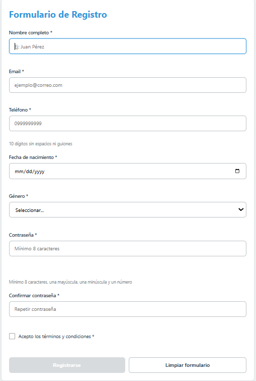

**Descripción:** Vista inicial del formulario. El botón de registro se mantiene inactivo hasta que todos los campos requeridos contengan información.

### 2. Errores de validación


**Descripción:** Múltiples campos con borde rojo y mensajes de error específicos por campo, activados en tiempo real mediante el evento `focusout`.

### 3. Campos válidos


**Descripción:** Feedback visual positivo con bordes verdes que indican que las entradas cumplen con las reglas lógicas y las Expresiones Regulares.

### 4. Indicador de fuerza de contraseña

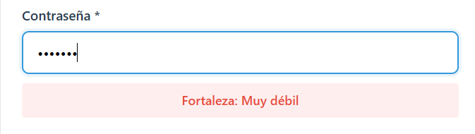

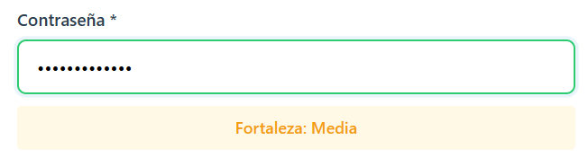

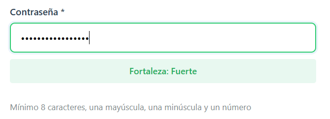

**Descripción:** Evaluación dinámica que muestra al menos 3 niveles diferentes de seguridad (Débil, Media, Fuerte) basándose en la longitud y el uso de caracteres especiales, números y mayúsculas.

### 5. Error de contraseñas no coinciden

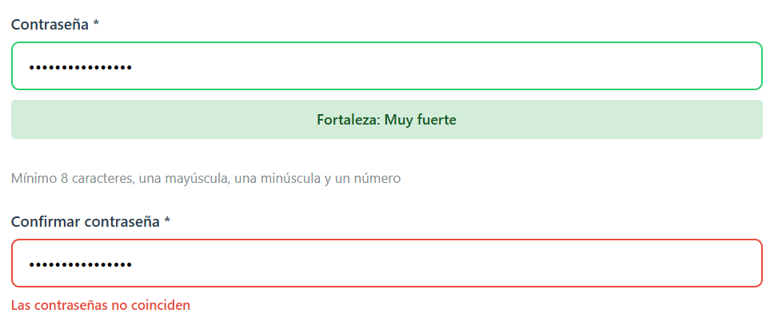

**Descripción:** Validación cruzada en el campo de confirmación, generando un mensaje de error si el valor no es estrictamente idéntico al de la contraseña principal.

### 6. Máscara de teléfono

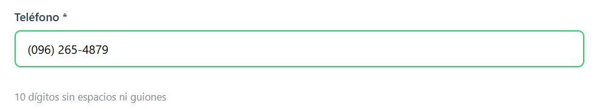

**Descripción:** Formato automático `(099) 999-9999` aplicado dinámicamente sobre el input de tipo `tel` mientras el usuario teclea los dígitos.

### 7. Envío exitoso

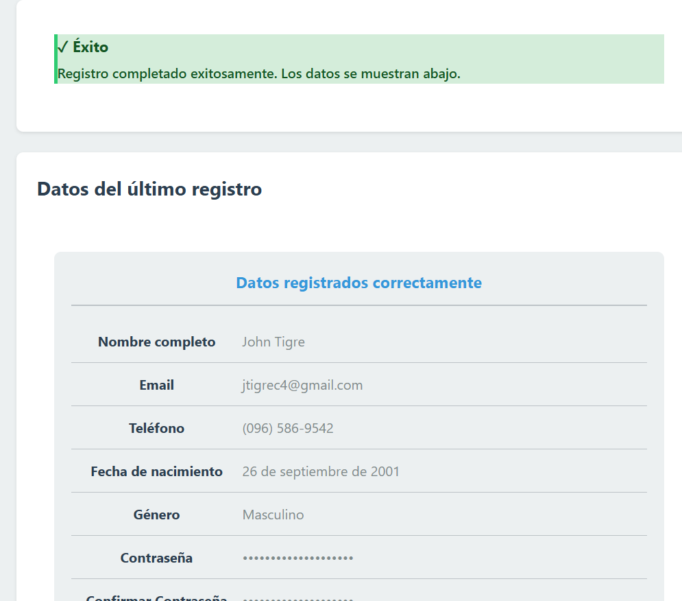

**Descripción:** Mensaje verde temporal que confirma el éxito de la validación y envío, inyectado de forma segura en el DOM tras procesar el formulario.

### 8. Tarjeta de resultado

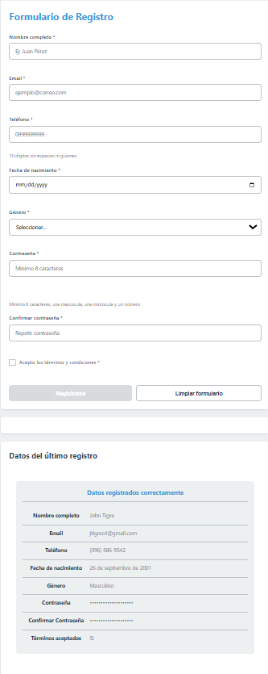

**Descripción:** Componente generado con `createElement` que formatea los datos enviados (traducción de géneros, fechas localizadas y ocultamiento visual de contraseñas con viñetas).

### 9. Consola (Datos impresos)

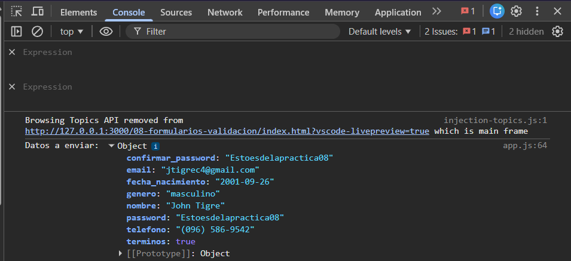

**Descripción:** Demostración en la consola de herramientas de desarrollador de los datos serializados con `FormData` y depurados (sin la confirmación de la contraseña) listos para enviar al backend.

### 10. Código de Validación y Componentes

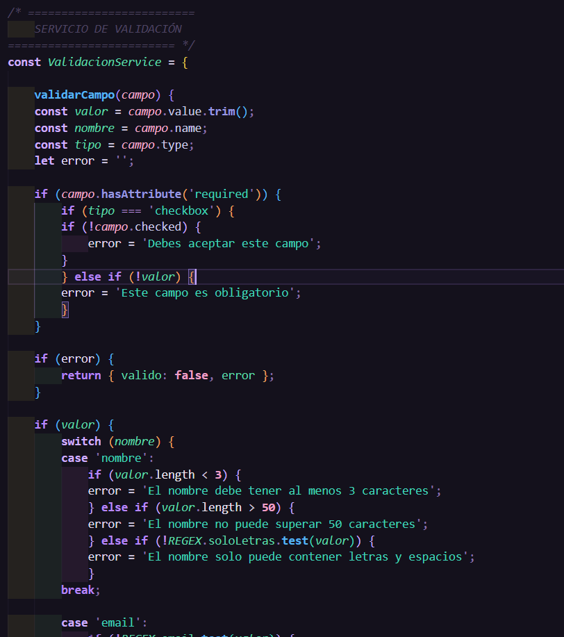

**Descripción:** Captura del archivo `validacion.js` mostrando el servicio centralizado y el uso de sentencias `switch` y Regex para validar cada campo.

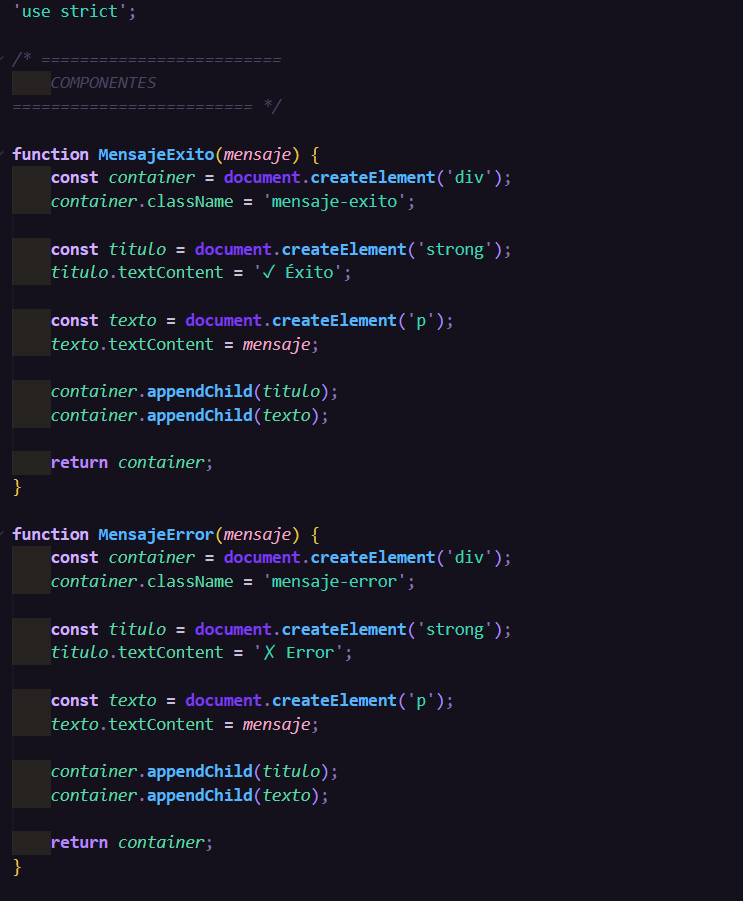

**Descripción:** Captura del archivo `components.js` evidenciando la construcción de los mensajes de alerta haciendo uso estricto de la API del DOM para evitar XSS.